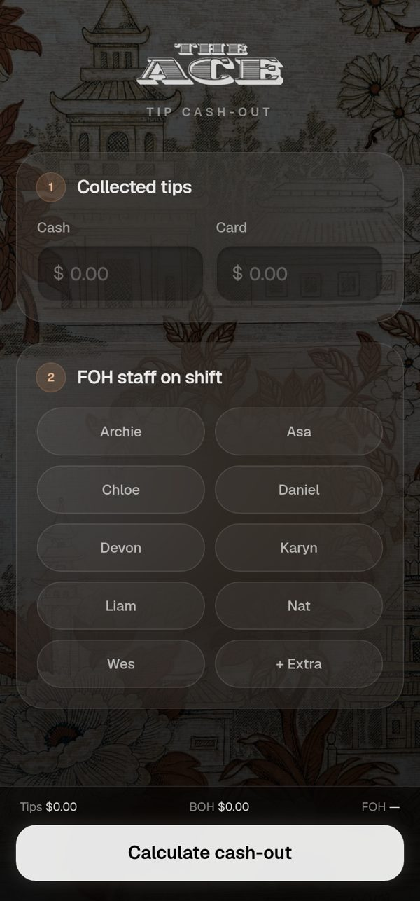
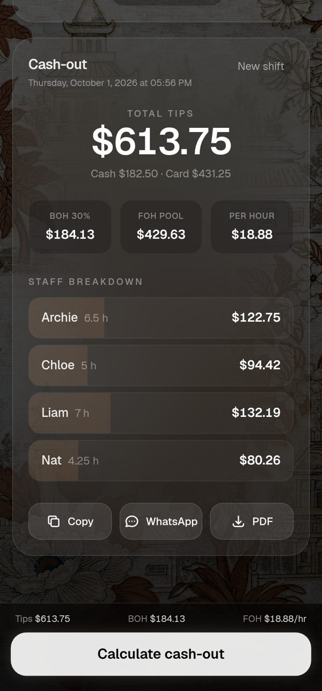

# The Ace · Tip Cash-Out Calculator

A small web app for splitting a restaurant shift's tips. Enter the cash and card tips, pick who worked front of house, add their hours, and get each person's payout. Built for the staff at The Ace and used on a phone at the end of the night.

**Live:** https://cholohotsauce.github.io/cashout-calculator/

<p>
  
  &nbsp;
  
</p>

## How the split works

1. Cash and card tips are added into one pool.
2. 30% goes to the kitchen (BOH).
3. The remaining 70% is the FOH pool, shared by hours worked: `rate = FOH pool / total FOH hours`, and each person gets `hours × rate`.

## Features

- Live preview of the total, BOH share and hourly rate in the bottom bar, plus an estimate next to each person's hours as you type.
- Inline validation that points at the missing field instead of a pop-up.
- A results card that flags when inputs changed after calculating.
- Copy to clipboard, share to WhatsApp, or save a formatted PDF report (jsPDF loads only when you first save).
- A "+ Extra" slot for someone who isn't on the regular roster.
- Mobile first: large tap targets, a sticky action bar, safe-area padding and reduced-motion support.

## Tech

[Next.js](https://nextjs.org) 16 (App Router, static export) · React 19 · TypeScript · Tailwind CSS 4 · Framer Motion · jsPDF. It's deployed to GitHub Pages by [`.github/workflows/nextjs.yml`](.github/workflows/nextjs.yml) on every push to `main`.

```
app/page.tsx            UI and state
app/components/Toast    lightweight notifications
lib/cashout.ts          split math, formatting and the shareable text
lib/pdf.ts              PDF report layout
```

## Run it locally

```bash
npm install
npm run dev     # http://localhost:3000/cashout-calculator
npm run build   # static site in ./out
npm run lint
```

The app is served under `/cashout-calculator` (see `basePath` in `next.config.ts`) to match its GitHub Pages URL.
